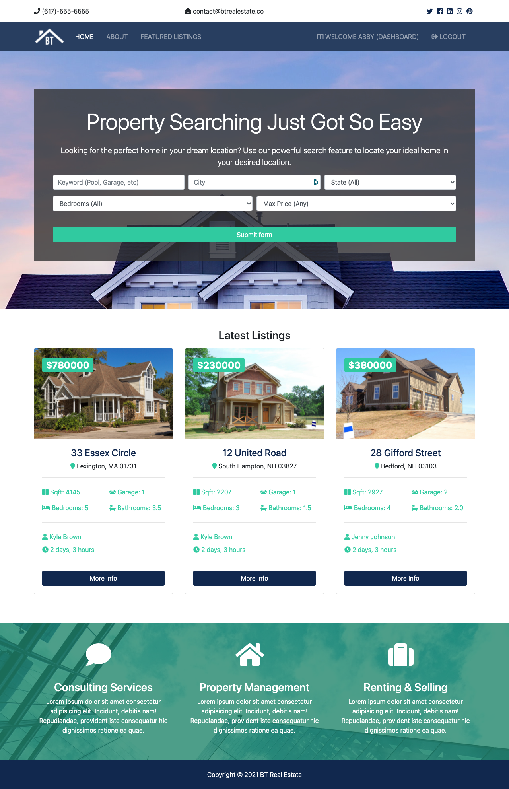

[![Contributors][contributors-shield]][contributors-url]
[![Forks][forks-shield]][forks-url]
[![Stargazers][stars-shield]][stars-url]
[![Issues][issues-shield]][issues-url]
[![MIT License][license-shield]][license-url]
[![LinkedIn][linkedin-shield]][linkedin-url]

<!-- PROJECT LOGO -->
<br />
<p align="center">
  <a href="https://github.com/drobb2020/readme-template">
    
  </a>

  <h3 align="center">BT Real Estate Website (Django)</h3>

  <p align="center">
    Real Estate website built using Python and Django 3.2.x. Based on a Packt course hosted by Brad Traversy
    <br />
    <a href="https://github.com/drobb2020/btre_project"><strong>Explore the docs »</strong></a>
    <br />
    <br />
    <a href="https://github.com/drobb2020/btre_project">View Demo</a>
    ·
    <a href="https://github.com/drobb2020/btre_project/issues">Bugs</a>
    ·
    <a href="https://github.com/drobb2020/btre_project/issues">Request Feature</a>
  </p>
</p>

<!-- TABLE OF CONTENTS -->

- [About The Project](#about-the-project)
  - [Built With](#built-with)
  - [Security updates](#security-updates)
  - [Security Updates 2022](#security-updates-2022)
  - [Security Updates 2024.1](#security-updates-20241)
  - [Security Updates 2024.2](#security-updates-20242)
  - [Project Update 2024](#project-update-2024)
- [Getting Started](#getting-started)
  - [Prerequisites](#prerequisites)
  - [Installation](#installation)
- [Usage](#usage)
- [Updated Project 2022](#updated-project-2022)
- [Roadmap](#roadmap)
- [Contributing](#contributing)
- [License](#license)
- [Contact](#contact)
- [Acknowledgements](#acknowledgements)

<!-- ABOUT THE PROJECT -->
## About The Project



I found this project on O'Rielly, and I really like Brad Traversey's teaching methods. Since this was a project based course and I wanted to do another Django project this was perfect. I also signed up for a free trial at Packt to get the starter files for this project.

### Built With

- [Python 3.9.6](https://www.python.org/downloads/)
- [Django 3.2.6](https://www.djangoproject.com/)
- [PostgreSQL 13.4](https://postgresapp.com/)

Now Running on

- [Python 3.11.9](https://www.python.org/downloads/)
- [Django 5.0.6](https://www.djangoproject.com/)
- [PostgreSQL 13.4](https://postgresapp.com/)

### Security updates

- Python has been updated to 3.9.10
- Django has been updated to 3.2.12
- Pillow has been updated to 9.0.1

### Security Updates 2022

- Python updated to 3.9.13
- Django updated to 3.2.14
- Pillow updated to 9.2.0

### Security Updates 2024.1

- Pillow updated to 10.2.0

These updates were necessary to address security vulnerabilities

### Security Updates 2024.2

- Django updated to 5.0.6
- pillow updated to 10.3.0
- sqlparse updated to 5.0.0

### Project Update 2024

At some point in 2024 I will be updating all the code in this project to Django 5.0.x

<!-- GETTING STARTED -->
## Getting Started

To get a local copy up and running follow these simple steps. This project was created on MacOS BigSur (M1 chip). The steps below are for that OS. To get this running on Windows may be different.

### Prerequisites

You will require the following software installed locally on your system or on an appropriate server:

- Python

  1. Download the latest version of Python from python.org, or use brew to install Python. Follow the well published instructions on successfully installing the latest version of Python.

- PostgreSQL

  1. For mac go to the postgres.app website and download the appropriate version of postgres. At the time of writing this was version 13.4. For the M1 make sure you download a universal version.
  2. Use the Postgres.app to create a database server. You will see an initialize button, click that.
  3. Install pgAdmin4 to administer the database.

### Installation

1. Clone the btre_project

   ```sh
   git clone https://github.com/drobb2020/btre_project.git
   ```

2. Create a virtual environment in the btre_project folder:

   ```sh
   cd btre_project
   python3 -m venv venv
   ```

3. Activate the virtual environment:

    ```sh
    source venv/bin/activate
    ```

4. Install the necessary python packages using pip:

    ```sh
    pip install -r requirements.txt
    ```

5. You should now be able to execute:

    ```sh
    python manage.py runserver
    ```

<!-- USAGE EXAMPLES -->
## Usage

This is a learning project for me to get comfortable with Django. While the login/logout/register and dashboard are all functional this site is not production ready.

## Updated Project 2022

The original project exposed a lot of confidential information. I have now added python-decouple and django-extensions to the project to create a new secret key and decouple to place all the confidential settings in a .env file. See the env_example file to see which settings are now hidden.

Make sure you add your .env file to the .gitignore file if it is not already there.

<!-- ROADMAP -->
## Roadmap

See the [open issues](https://github.com/drobb2020/btre_project/issues) for a list of proposed features (and known issues).

<!-- CONTRIBUTING -->
## Contributing

Contributions are what make the open source community such an amazing place to be learn, inspire, and create. Any contributions you make are **greatly appreciated**.

1. Fork the Project
2. Create your Feature Branch (`git checkout -b feature/AmazingFeature`)
3. Commit your Changes (`git commit -m 'Add some AmazingFeature'`)
4. Push to the Branch (`git push origin feature/AmazingFeature`)
5. Open a Pull Request

<!-- LICENSE -->
## License

Distributed under the MIT License. See `LICENSE` for more information.

<!-- CONTACT -->
## Contact

Email: [David Robb](drobb2011@gmail.com)

Project Link: [https://github.com/drobb2020/btre_project](https://github.com/drobb2020/btre_project)

<!-- ACKNOWLEDGEMENTS -->
## Acknowledgements

- [Brad Traversey](https://www.traversymedia.com/)
- [O'Reilly Learning](https://learning.oreilly.com/videos/python-django-dev/9781838641283/9781838641283-video1_1/)
- [Packt](https://subscription.packtpub.com/)

<!-- MARKDOWN LINKS & IMAGES -->
<!-- https://www.markdownguide.org/basic-syntax/#reference-style-links -->
[contributors-shield]: https://img.shields.io/github/contributors/drobb2020/btre_project.svg?style=for-the-badge
[contributors-url]: https://github.com/drobb2020/btre_project/graphs/contributors
[forks-shield]: https://img.shields.io/github/forks/drobb2020/btre_project.svg?style=for-the-badge
[forks-url]: https://github.com/drobb2020/btre_project/network/members
[stars-shield]: https://img.shields.io/github/stars/drobb2020/btre_project.svg?style=for-the-badge
[stars-url]: https://github.com/drobb2020/btre_project/stargazers
[issues-shield]: https://img.shields.io/github/issues/drobb2020/btre_project.svg?style=for-the-badge
[issues-url]: https://github.com/drobb2020/btre_project/issues
[license-shield]: https://img.shields.io/github/license/drobb2020/btre_project.svg?style=for-the-badge
[license-url]: https://github.com/drobb2020/btre_project/blob/master/LICENSE.txt
[linkedin-shield]: https://img.shields.io/badge/-LinkedIn-black.svg?style=for-the-badge&logo=linkedin&colorB=555
[linkedin-url]: https://www.linkedin.com/in/david-robb-42436a20/
